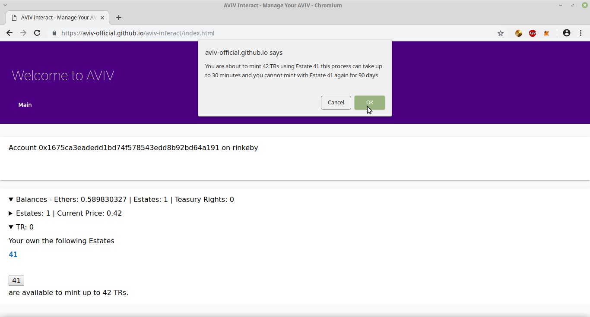

# Welcome to our deployment and testing guide, please read the whole thing.

Table of Contents
--------------------------
Step #1 Install Metamask

Step #2 Acquire Testnet ETH for Rinkeby

Step #3 Add deployed tokens to Metamask

Step #4 Acquire an Estate

Step #5 Use your Estate to mint TRs

Step #6 Use your TRs and some Testnet ETH to mint some XTokens

Step #7 Join us on discord!

-------------------------

Step #1 Install Metamask
------------------------
We have our own browser plugin tool in development called AIM or AVIV Identity Manager, however this is as yet unreleased and thus for the purposes of development we recommend you use Metamask.
You can install [Metamask from Google Webstore](https://chrome.google.com/webstore/detail/metamask/nkbihfbeogaeaoehlefnkodbefgpgknn) and it will work fine for Chrome, Chromium, Vivaldi and Brave browsers, probably others as well.  At the moment we have only tested it on Chromium and Brave.

Once it has been installed, open it up and go through the configuration steps and once this is done, please ensure you set the network to **Rinkeby Test Network**.
 

------------------------
Step #2 Acquire Testnet ETH for Rinkeby
------------------------

After installing and configuring metamask, you will need to acquire some Rinkeby Testnet Ethers.  There are a couple of very good ones but we officially recommend the official faucet at https://faucet.rinkeby.io
Follow the instructions exactly to ensure you get the maximum amount of Ether which is presently 18.75 Ethers / 3 day as shown below.

http://i.imgur.com/Gi9nwOi.png
------------------------
Step #3 Add deployed tokens to Metamask
------------------------
All of our tokens are deployed on Rinkeby

Estates are deployed at 0x2fb85edb249c960b3d1bf951e96f9cc9d281c3d3

TRs are deployed at 0x4f7d9535ef4069207eee95fbc967d821a75584f0

XAV is deployed at 0xc0dddba97c2455b0ecb1682b81ab3b02b6cf7f1b

Instructions for adding the tokens to [metamask are here](https://metamask.zendesk.com/hc/en-us/articles/360015489031-Adding-and-Managing-Tokens-ERC20-In-The-New-UI)
Note that Metamask has no idea about our tokens yet because we're still in development.  Therefore you need to follow the "Add Custom Token" instructions which read...

**The steps to add custom token are as follows:**

1. On the “Add Token” page, click on “Add custom token” to expand the search window.
2. Enter token address of interest in the space under “Token Address”.
3. Click next to proceed
4. You will be directed to confirm adding token. Click “Add Token” to confirm.

------------------------
Step #4 Acquire an Estate
------------------------

Go to [AVIV Interact!](https://aviv-official.github.io/aviv-interact/index.html)

*Press "Connect to Wallet" button*

This first time you connect, you will be prompted by MetaMask if you want the page to connect to your wallet, go ahead and accept.

*Expand the "Balances" line*

*Expand the "Estates" line*

*Input the quantity you wish to purchase, then press the "Purchase" button*

*Confirm with MetaMask*

From here it is a matter of waiting, it can take up to 30 minutes to acquire your Estate from the Estate Sale contract, depending on how congested the network is.  There is not much visual feedback, but ...

*the balance will eventually update to reflect your purchase*

Note that the funds will be sent to the Estate Sale contract, not the Estate contract itself.
This contract is located at 0xb3bd49f024b19a88dfed3b8c9aff5dfb7c92414e which you don't need to worry about, but you should verify your funds are going there.

The Estate Sale contract located at 0xb3bd49f024b19a88dfed3b8c9aff5dfb7c92414e is a contract for crowdselling Estates, it will mint the Estate for you and forward your funds to ELF, the Estate Lending Facility.  Do not send funds directly to the Estate contract.  Doing so can result in funds being lost.

------------------------
Step #5 Use your Estate to mint TRs
------------------------

Go to [AVIV Interact!](https://aviv-official.github.io/aviv-interact/index.html)

*Press "Connect to Wallet" button*

This first time you connect, you will be prompted by MetaMask if you want the page to connect to your wallet, go ahead and accept.

*Expand the "Balances" line*

*Expand the TR line*

Here you will see a list of links showing all the Estates you own as well as one or more buttons corresponding to Estates which are available and ready to use to mint Treasury Rights.  

Estates can be used to mint Treasury Rights (TRs) once every 90 days.  The first time an estate is used, you can mint 42 TRs.  After that, each Estate is only valid for a single TR once every 90 days.  However these do roll over, thus at 180 days you can mint 2, at 360 days you can mint 4 etc.

*Remember it can take up to 30 minutes for the blockchain to acknowledge you*

*Press the button corresponding to the Estate you wish to use for minting TRs*

*Acknowledge the rules*

*Confirm with MetaMask*

*Your balance will eventually auto update*

------------------------
Step #6 Use your TRs and some Testnet ETH to mint some XTokens
-------------------------

Once you have a TR, you must send it to the XAV contract in order to mint XAV.
Therefore send 1 TR to 0xc0dddba97c2455b0ecb1682b81ab3b02b6cf7f1b using MetaMask.

Next use the "deposit to token" function to deposit some ETH to your Token under the Estate Lending Facility or ELF, this way you can have a credit balance.  

>Your credit balance is not the same amount as your deposit balance.  Credit is based on a bit of math applied to the current condition of the contract vs your deposit.  

>You can see that your deposit amount is different from your credit limit.  There is no need to worry, your credit limit is in part controlled by your deposit balance and can be up to 2x your deposit, but may be some fraction of it depending on how much ether is in the contract.  The credit line for any single token will never exceed totalSupply / total contract balance, regardless of the amount deposited.  You are free to withdraw excess funds deposited at any point in time.

>If your balance is greater than your credit limit, you can take on more than one loan.  But all loans are treated as a single loan for accounting purposes.

>So for example if there are 100 Estates, you own 1, you have deposited 1 ETH to your token and the current contract balance is 200 ETH, then your credit limit will be 2 ETH.  But if there are only 50 ETH on contract you credit limit will be 0.5 ETH.  However you can withdraw the excess 0.5 or you can open several loans at 0.5 ETH each until your balance runs negative. 

Next you need to set XAV as the agent for your Estate, to do so, you simply put the address in as agent.

The final step is to notify the XAV contract that it is your agent, and this will also automatically mint your entire credit limit to XAV.  You can repeat this process for as many TRs as you possess.

-------------------------
Step #7 Join us on discord!
-------------------------

[Here is the invite for discord!  Come join the fun!](https://discord.gg/RJF6mBm)

